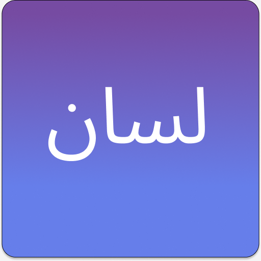
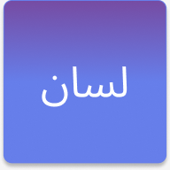

# 🎨 APP-LISAN ICON DESIGN GUIDE

Complete guide to creating professional app icons for App-lisan PWA.

---

## 📋 **ICON REQUIREMENTS**

### **Technical Specifications**

| Size | Filename | Purpose | Priority |
|------|----------|---------|----------|
| 512×512px | icon-512.png | App stores, splash screen | ⭐⭐⭐ Required |
| 192×192px | icon-192.png | Home screen, app drawer | ⭐⭐⭐ Required |
| 180×180px | apple-touch-icon.png | iOS home screen | ⭐⭐ Recommended |
| 32×32px | favicon.ico | Browser tab | ⭐ Optional |

### **File Format Requirements**
- ✅ **Format:** PNG (24-bit with alpha transparency)
- ✅ **Color Space:** sRGB
- ✅ **Compression:** PNG-8 or PNG-24
- ✅ **Background:** Transparent OR solid color
- ✅ **Naming:** Exact case-sensitive filenames

---

## 🎨 **DESIGN CONCEPT FOR APP-LISAN**

### **Brand Identity**

**Color Palette:**
```
Primary:   #667eea (Blue-Purple)
Secondary: #764ba2 (Deep Purple)
Accent:    #ffffff (White)
Dark:      #2d2d2d (Dark Gray)
```

**Typography:**
- App Name: "App-lisan" or stylized "AL"
- Font: Bold, modern, sans-serif
- Arabic: Consider using Arabic calligraphy

**Symbol Ideas:**
1. 🗣️ Speech bubble with Arabic/English letters
2. 📚 Book with Arabic characters
3. 🌐 Globe with Arabic script
4. 💬 Translation arrows (⇄) between ع and A
5. 🎙️ Microphone with Arabic letter

---

## 🖼️ **DESIGN OPTIONS**

### **Option 1: Minimalist Badge** ⭐ Recommended

```
┌─────────────────┐
│                 │
│    ┌─────┐     │
│    │ AL  │     │  Gradient background
│    │ 🗣️  │     │  White badge
│    └─────┘     │  Bold text + emoji
│                 │
└─────────────────┘
```

**Features:**
- Clean, modern look
- Works at all sizes
- High contrast
- Memorable

### **Option 2: Arabic Calligraphy**

```
┌─────────────────┐
│                 │
│      ل س        │  Stylized Arabic letters
│      ا ن        │  "LISAN" in Arabic
│                 │  Gradient or solid bg
│                 │
└─────────────────┘
```

**Features:**
- Authentic Arabic feel
- Artistic
- Cultural connection
- Unique

### **Option 3: Bilingual Symbol**

```
┌─────────────────┐
│                 │
│    ع ⇄ A       │  Arabic ↔ English
│                 │  Translation concept
│  App-lisan     │  Name below
│                 │
└─────────────────┘
```

**Features:**
- Shows app purpose
- Clear communication
- Professional
- Bilingual

### **Option 4: Speech Bubble**

```
┌─────────────────┐
│                 │
│    💬           │  Stylized bubble
│   ┌───┐        │  With AL or ع
│   │ A │        │  Modern design
│   │ L │        │
│   └───┘        │
└─────────────────┘
```

**Features:**
- Friendly, approachable
- Communication theme
- Modern app aesthetic

---

## 🛠️ **CREATION METHODS**

### **Method 1: Online Icon Generator** ⭐ Easiest

#### **Using RealFaviconGenerator (Recommended)**

1. **Visit:** https://realfavicongenerator.net/

2. **Upload base design:**
   - Create 512×512px PNG in any design tool
   - Simple design works best
   - High contrast required

3. **Configure:**
   - ✅ Generate icons for all platforms
   - ✅ iOS: Enable transparency
   - ✅ Android: Use themed icon
   - ✅ Background color: #667eea

4. **Download:**
   - Get all sizes automatically
   - Place in project root

#### **Using Favicon.io**

1. **Visit:** https://favicon.io/
2. **Choose method:**
   - Text to icon (type "AL")
   - Image to icon (upload design)
   - Emoji to icon (use 🗣️)
3. **Customize:**
   - Background: #667eea
   - Text: White
   - Font: Bold
4. **Generate and download**

---

### **Method 2: Design Tools** (Best Quality)

#### **Using Figma** ⭐ Recommended

**Step-by-Step:**

1. **Create new file:**
   - Frame size: 512×512px
   - Name: "app-lisan-icon"

2. **Add background:**
   ```
   Rectangle: 512×512px
   Fill: Linear gradient
   - Color 1: #667eea (top-left)
   - Color 2: #764ba2 (bottom-right)
   Corner radius: 100px (rounded square)
   ```

3. **Add main element:**
   ```
   Option A - Text:
   - Text: "AL" or "App-lisan"
   - Font: Poppins Bold or SF Pro Bold
   - Size: 200px
   - Color: White
   - Align: Center

   Option B - Icon:
   - Import 🗣️ emoji or speech icon
   - Size: 300×300px
   - Center align

   Option C - Arabic:
   - Text: "لسان" (LISAN in Arabic)
   - Font: Arabic typography font
   - Size: Fit to frame
   - Color: White
   ```

4. **Add detail (optional):**
   ```
   Shadow:
   - X: 0, Y: 10
   - Blur: 30
   - Color: #00000030
   ```

5. **Export:**
   ```
   File → Export → PNG
   Settings:
   - 512×512px at 1x (icon-512.png)
   - 192×192px at 1x (icon-192.png)
   - Check "Preview" before export
   ```

**Figma Template:**
```
Download starter template:
[Create link to Figma community file]

Or start from scratch:
https://www.figma.com/
```

---

#### **Using Canva** (Beginner-Friendly)

1. **Create design:**
   - Go to Canva.com
   - "Custom size" → 512×512px
   - Search "App Icon Template"

2. **Customize:**
   - Change background to gradient
   - Add text: "AL" or "🗣️"
   - Use brand colors

3. **Download:**
   - File → Download → PNG
   - Resize to 192×192px for second icon

---

#### **Using Photoshop/GIMP**

1. **New document:**
   ```
   Width: 512px
   Height: 512px
   Resolution: 72 DPI
   Color Mode: RGB
   Background: Transparent
   ```

2. **Create gradient background:**
   ```
   Gradient Tool:
   - Type: Linear
   - Color 1: #667eea
   - Color 2: #764ba2
   - Angle: 45°
   ```

3. **Add text/icon:**
   ```
   Text Tool:
   - Font: Arial Black or similar
   - Size: 200px
   - Color: White (#ffffff)
   - Text: "AL"
   - Align: Center horizontally and vertically
   ```

4. **Add effects:**
   ```
   Layer Styles:
   - Drop Shadow: 
     * Opacity: 30%
     * Distance: 10px
     * Size: 20px
   ```

5. **Export:**
   ```
   Save As → PNG-24
   Filename: icon-512.png
   
   Then resize to 192×192:
   Image → Image Size → 192×192px
   Save As: icon-192.png
   ```

---

### **Method 3: Command Line (Advanced)**

#### **Using ImageMagick**

**Install:**
```bash
# macOS
brew install imagemagick

# Ubuntu/Debian
sudo apt-get install imagemagick

# Windows
# Download from: https://imagemagick.org/
```

**Generate basic icon:**
```bash
# Create 512×512 icon with gradient and text
convert -size 512x512 \
  gradient:#667eea-#764ba2 \
  -gravity center \
  -pointsize 200 \
  -font Arial-Bold \
  -fill white \
  -annotate +0+0 "AL" \
  icon-512.png

# Create 192×192 version
convert icon-512.png -resize 192x192 icon-192.png
```

**Advanced with effects:**
```bash
# Icon with shadow and rounded corners
convert -size 512x512 \
  xc:none \
  -draw "roundrectangle 0,0,512,512,50,50" \
  -fill "gradient:#667eea-#764ba2" \
  -draw "roundrectangle 0,0,512,512,50,50" \
  -gravity center \
  -pointsize 200 \
  -font Arial-Bold \
  -fill white \
  -annotate +0+0 "AL" \
  \( +clone -background black -shadow 80x3+0+10 \) \
  +swap -background none -layers merge +repage \
  icon-512.png

# Resize
convert icon-512.png -resize 192x192 icon-192.png
```

---

### **Method 4: Use Emoji** ⚡ Fastest

**Quick placeholder using emoji:**

```bash
# Using ImageMagick with emoji
convert -size 512x512 \
  gradient:#667eea-#764ba2 \
  -gravity center \
  -pointsize 300 \
  -annotate +0+0 "🗣️" \
  icon-512.png

convert icon-512.png -resize 192x192 icon-192.png
```

**Or use online:**
1. Go to: https://favicon.io/emoji-favicons/
2. Search: "speaking head"
3. Download generated icons

---

## ✅ **ICON DESIGN CHECKLIST**

Before finalizing your icon:

### **Visual Design**
- [ ] Simple enough to recognize at 32px
- [ ] High contrast (readable on light/dark backgrounds)
- [ ] No fine details that disappear when small
- [ ] Consistent with brand colors
- [ ] Unique and memorable

### **Technical Requirements**
- [ ] 512×512px version created (icon-512.png)
- [ ] 192×192px version created (icon-192.png)
- [ ] PNG format with transparency
- [ ] File size under 100KB each
- [ ] Files placed in project root directory

### **Testing**
- [ ] Looks good at 512px (full size)
- [ ] Looks good at 192px (home screen)
- [ ] Looks good at 64px (app drawer)
- [ ] Looks good at 32px (browser tab)
- [ ] Tested on light background
- [ ] Tested on dark background
- [ ] Tested on Android
- [ ] Tested on iOS

---

## 🎨 **READY-TO-USE DESIGN SPECS**

### **Design A: Modern Badge**

```
Size: 512×512px
Background: Linear gradient 45°
  - #667eea → #764ba2
Badge: 360×360px white rounded square
  - Corner radius: 60px
  - Center aligned
Text: "AL"
  - Font: SF Pro Bold / Poppins Bold
  - Size: 160px
  - Color: #667eea
  - Center aligned in badge
Icon: 🗣️ emoji (optional)
  - Size: 100px
  - Below text
Shadow: Soft, 30% opacity, 10px offset
```

### **Design B: Arabic Calligraphy**

```
Size: 512×512px
Background: Solid #667eea or gradient
Text: "لسان" (LISAN in Arabic)
  - Font: Arabic calligraphy font
  - Size: Fill 70% of canvas
  - Color: White
  - Center aligned
  - Optional: Add English "App-lisan" below
Border: 2px white (optional)
  - Rounded square, 50px radius
```

### **Design C: Minimalist**

```
Size: 512×512px
Background: Solid #667eea
Shape: Circle 400px
  - Fill: White
  - Center aligned
Text: "ل" (Arabic L) or "A"
  - Font: Bold sans-serif
  - Size: 280px
  - Color: #667eea
  - Center in circle
```

---

## 📦 **EXPORT CHECKLIST**

After creating your icon:

1. **Export both sizes:**
   ```
   ✅ icon-512.png (512×512px)
   ✅ icon-192.png (192×192px)
   ```

2. **Optimize file size:**
   ```bash
   # Using pngquant (optional, reduces size)
   pngquant --quality=80-95 icon-512.png
   pngquant --quality=80-95 icon-192.png
   ```

3. **Place in project root:**
   ```
   app-lisan/
   ├── icon-512.png    ← Here
   ├── icon-192.png    ← Here
   ├── index.html
   └── ...
   ```

4. **Verify in manifest.json:**
   ```json
   "icons": [
     {
       "src": "icon-192.png",
       "sizes": "192x192",
       "type": "image/png"
     },
     {
       "src": "icon-512.png",
       "sizes": "512x512",
       "type": "image/png"
     }
   ]
   ```

5. **Test installation:**
   - Serve app locally
   - Open in Chrome
   - Check "Add to Home Screen"
   - Verify icon appears correctly

---

## 🔍 **ICON TESTING**

### **Test on Different Platforms**

**Desktop:**
```
✅ Chrome (Windows/Mac/Linux)
✅ Edge
✅ Firefox
✅ Safari (Mac)
```

**Mobile:**
```
✅ Chrome (Android)
✅ Safari (iOS)
✅ Samsung Internet
✅ Opera Mobile
```

### **Test at Different Sizes**

Use this HTML test page:

```html
<!DOCTYPE html>
<html>
<head>
  <title>Icon Test</title>
  <style>
    body { padding: 2rem; font-family: sans-serif; }
    .test-row { margin: 2rem 0; }
    img { margin: 1rem; border: 1px solid #ddd; }
  </style>
</head>
<body>
  <h1>App-lisan Icon Test</h1>
  
  <div class="test-row">
    <h2>32×32px (Favicon)</h2>
    
  </div>
  
  <div class="test-row">
    <h2>64×64px (App Drawer)</h2>
    
  </div>
  
  <div class="test-row">
    <h2>192×192px (Home Screen)</h2>
    
  </div>
  
  <div class="test-row">
    <h2>512×512px (Full Size)</h2>
    
  </div>
  
  <div class="test-row" style="background: #000; padding: 2rem;">
    <h2 style="color: white;">Dark Background Test</h2>
    
  </div>
</body>
</html>
```

Save as `icon-test.html` and open in browser.

---

## 💡 **PRO TIPS**

### **Do's:**
- ✅ Keep it simple and recognizable
- ✅ Use high contrast colors
- ✅ Test at multiple sizes
- ✅ Make it unique to your brand
- ✅ Consider both light and dark modes
- ✅ Use vector graphics when possible
- ✅ Export at exact required sizes

### **Don'ts:**
- ❌ Don't use too many colors (3 max)
- ❌ Don't add fine details (they disappear)
- ❌ Don't use photographs (low quality at small sizes)
- ❌ Don't make it too complex
- ❌ Don't forget transparency if needed
- ❌ Don't use gradients on very small icons
- ❌ Don't forget to test on real devices

---

## 🎯 **QUICK START TEMPLATES**

### **Template 1: Text-Based**

**Figma/Canva:**
1. 512×512px canvas
2. Gradient background (#667eea → #764ba2)
3. White text "AL" (200px, bold, centered)
4. Export PNG

**Time: 5 minutes**

### **Template 2: Emoji-Based**

**Online Tool:**
1. Go to favicon.io
2. Choose "Emoji to Icon"
3. Select 🗣️ emoji
4. Background: #667eea
5. Download

**Time: 2 minutes**

### **Template 3: Professional**

**Design Tool:**
1. Use design specs from "Design A" above
2. Create in Figma/Photoshop
3. Add shadow and effects
4. Export multiple sizes

**Time: 20 minutes**

---

## 🚀 **AFTER CREATING ICONS**

1. **Place files in project root:**
   ```
   ✅ icon-512.png
   ✅ icon-192.png
   ```

2. **Verify manifest.json paths:**
   ```json
   "icons": [
     { "src": "icon-192.png", "sizes": "192x192", "type": "image/png" },
     { "src": "icon-512.png", "sizes": "512x512", "type": "image/png" }
   ]
   ```

3. **Test locally:**
   ```bash
   python -m http.server 8000
   # Open http://localhost:8000
   # Try "Add to Home Screen"
   ```

4. **Deploy and test on real device:**
   - Install as PWA
   - Check home screen icon
   - Verify splash screen
   - Test in app drawer

---

## 📚 **RESOURCES**

**Design Inspiration:**
- https://www.figma.com/@icons (Icon templates)
- https://dribbble.com/tags/app_icon (Icon designs)
- https://www.uplabs.com/search?q=app%20icon (More designs)

**Icon Generators:**
- https://realfavicongenerator.net/ (Best all-in-one)
- https://favicon.io/ (Simple and fast)
- https://www.favicon-generator.org/ (Alternative)

**Design Tools:**
- https://www.figma.com/ (Free, online)
- https://www.canva.com/ (Beginner-friendly)
- https://www.photopea.com/ (Free Photoshop alternative)

**Validation:**
- https://manifest-validator.appspot.com/ (Check manifest)
- https://web.dev/measure/ (PWA checklist)

---

## ✅ **FINAL CHECKLIST**

Before considering icons complete:

- [ ] icon-512.png created and placed in root
- [ ] icon-192.png created and placed in root
- [ ] Files are PNG format
- [ ] Files are under 100KB each
- [ ] Icons look good at all sizes (32px to 512px)
- [ ] Icons work on light and dark backgrounds
- [ ] manifest.json references correct filenames
- [ ] Tested PWA installation locally
- [ ] Icons appear correctly on home screen
- [ ] Satisfied with design quality

---

**🎨 Your icons are now ready for production!**

*For questions or help, refer to the main README.md*

---

*Last updated: December 2025*  
*App: App-lisan*  
*Version: 1.0.0*
